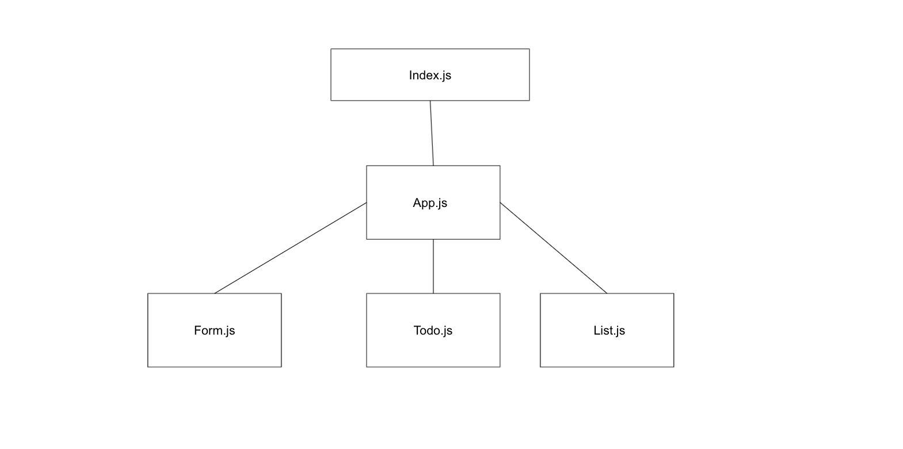

# Project: To Do List Manager

## Author: Elijah Prom

## Links and Resources]

[PR: 1](https://github.com/S2Mackinley/todo-codefellows/pull/1)

[Deployed:](https://todo-list-ep.netlify.app/)

### Dependencies

- bootstrap
- node-sass
- react
- react-bootstrap
- react-dom
- react-jsonschema-form
- react-router-dom
- react-scripts
- uuid

### How to initialize/run your application (where applicable)

- `npm start`

## UML

